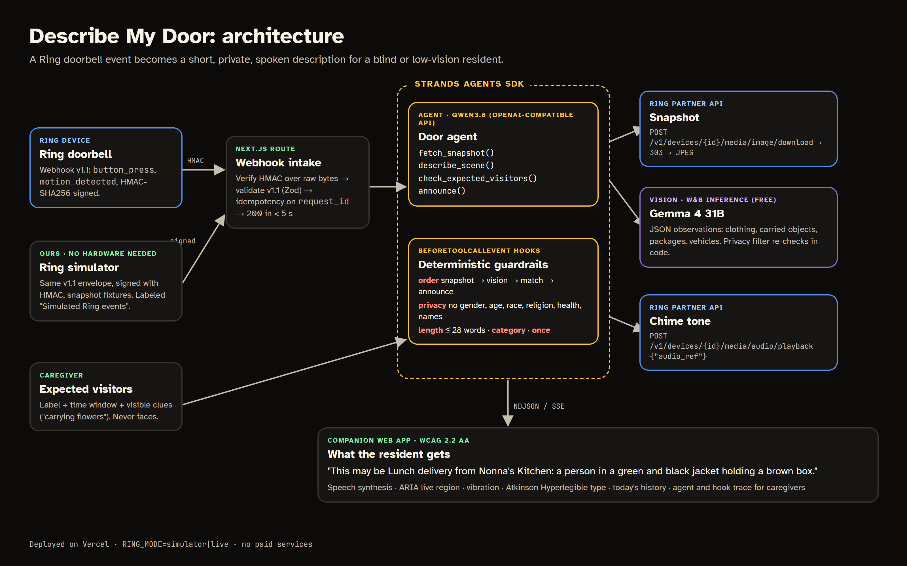

# Describe My Door

**Hear who is at your Ring doorbell.** Describe My Door is a Ring app for blind and low-vision residents. When someone rings the doorbell or leaves a package, a **Strands agent** downloads the Ring snapshot, describes the scene in one or two plain sentences ("This may be Lunch delivery from Nonna's Kitchen: a person in a green and black jacket holding a brown box"), checks it against the visitors a caregiver said to expect, and speaks it on the resident's phone while the Ring Chime sounds a matching tone. It never guesses who someone is.

**Live demo:** https://describe-my-door.vercel.app (no login) · **Pitch deck:** https://describe-my-door.vercel.app/slides.html · **Video:** _link added at submission_

Built new for the Amazon *Build, Ship, Shape* hackathon (submission window from Aug 31, 2026) · Ring track · AWS Builder mini-challenge (Strands Agents SDK).



## The problem

A video doorbell is a screen. For someone who can't see the screen, "who's at the door?" still means opening the door to a stranger, or calling someone to look at the camera for them.

- Approximately **7 million people in the United States have vision impairment, including 1 million with blindness** ([CDC, Vision and Eye Health: Fast Facts](https://www.cdc.gov/vision-health/data-research/vision-loss-facts/index.html)).
- Doorbell apps already detect motion and people, but they deliver it as video, thumbnails and push notifications with no description. Packages left on the step go unnoticed.

**Who it's for:** blind and low-vision people who live independently, older adults whose sight is fading, and the family caregivers who can't be there at every knock.

## Our solution

1. **A Ring event arrives.** The doorbell's `button_press` or `motion_detected` webhook is verified (HMAC-SHA256 over the raw body) and validated against the Ring webhook v1.1 schema.
2. **The Strands agent works through four tools:** `fetch_snapshot` (Ring image download at the event timestamp) → `describe_scene` (a vision model returns structured observations: clothing, carried objects, packages, vehicles) → `check_expected_visitors` (deterministic match against the caregiver's list by time window and visible clues) → `announce`.
3. **Guardrails are code, not prompts.** Strands `BeforeToolCallEvent` hooks block any announcement that mentions gender, age, race, religion, health or a possible name; runs over 28 words; claims an expected visitor the evidence doesn't support; or skips a step. The agent sees the reason and rewrites. The demo shows a real block and retry.
4. **The resident hears it.** The companion web app speaks the description (speech synthesis), announces it through an ARIA live region for screen readers, vibrates, and keeps a "today" history. The Ring Chime plays the app's visitor or package tone.
5. **The caregiver sets expectations once:** "Maria and Tom from next door · 14:00–16:00 · flowers". A visitor carrying flowers at 14:32 is announced as "This may be Maria and Tom from next door". The same match at 19:05 is not made. Matching never uses faces.

What the human still decides: whether to open the door.

## What is real Ring, and what is simulated

The app has three modes (`RING_MODE`), and the UI labels every element so nothing over-claims.

| | `simulator` (public demo) | `hybrid` (with a Playground token) | `live` (real account + hardware) |
| --- | --- | --- | --- |
| Devices, capabilities, status | simulated | **Ring Partner API** | Ring |
| Doorbell / motion event | simulated, signed v1.1 webhook | simulated, signed v1.1 webhook | Ring webhook |
| Snapshot | sample image | sample image (Ring returns 403, see below) | Ring image download |
| Chime tone | simulated | simulated | Ring audio playback |

We hold a Ring developer account with two private apps, and measured the **Developer Playground** on 16 Sep 2026 with a live token (scope `ava.v1:read`):

- `GET /v1/devices` returns exactly one device, a Doorbell Pro called "Playground Device"; `capabilities`, `status`, `configurations`, `locations` and `users/me` all work.
- `POST /media/image/download` answers **403 `TIME_RANGE_NOT_AUTHORIZED`** for every timestamp we tried (and `REQUEST_FORBIDDEN` without one), so the sandbox serves no footage.
- `configurations.audio.customizable_slots` is `null` and audio playback returns 400: there is no chime, and a read-only token cannot write.
- `GET /v1/history/devices/{id}/events` is always empty, and the Playground's Package / Vehicle / Motion buttons only open a WHEP live-view session in the browser; they are not delivered to a partner webhook.

That is why hybrid mode exists: the reads that Ring really serves are live, and the parts the sandbox cannot do stay simulated **and labeled** (`SAMPLE IMAGE` on the camera, "· simulated" next to the chime status, "simulated" on the webhook row). Details and suggestions are in [`FRICTION_LOG.md`](FRICTION_LOG.md) #6 and #7; switching modes is in [`docs/ring-live-checklist.md`](docs/ring-live-checklist.md).

## How we use Amazon's technology

### Ring Partner API (Ring track)

| Capability | Endpoint / contract | Code |
| --- | --- | --- |
| Doorbell and motion events | Webhook v1.1 envelope, `X-Signature: sha256=<hex>` HMAC-SHA256 of the raw body, idempotency on `meta.request_id`, 200 within 5 s (agent runs after the response) | `app/api/ring/webhook/route.ts`, `lib/ring/webhook.ts`, `lib/intake.ts` |
| Motion classification | `data.attributes.sub_type` (`human`, `vehicle`, …) | `lib/ring/webhook.ts`, `lib/agent/door-agent.ts` |
| Devices, capabilities, status | `GET /v1/devices`, `/capabilities`, `/status` (live in hybrid mode, shown in the UI) | `lib/ring/client.ts`, `app/api/ring/status/route.ts` |
| Snapshot at the event | `POST /v1/devices/{id}/media/image/download` with `type: at_timestamp`, following the 303 redirect | `lib/ring/client.ts` |
| Chime tone | `GET /v1/devices/{id}/configurations` → `audio.customizable_slots`, then `POST /v1/devices/{id}/media/audio/playback` with `{"data":{"type":"audio","attributes":{"audio_ref":…}}}` | `lib/ring/client.ts` |
| Auth | Playground access token or OAuth refresh token (`https://oauth.ring.com/oauth/token`) | `lib/ring/client.ts` |

Design notes that came from the Ring docs and from testing:
- Chime playback accepts only an `audio_ref` already in one of the app's slots, not generated speech. So the chime plays a category tone and the full description is spoken on the companion app (see [`FRICTION_LOG.md`](FRICTION_LOG.md) #1).
- Motion `sub_type` has no package class, so packages are counted from the snapshot instead.
- Ring API calls are server-to-server only, as the docs require.

### AWS: Strands Agents SDK (AWS Builder mini-challenge)

- `lib/agent/door-agent.ts` uses `@strands-agents/sdk` (TypeScript):
  - `Agent` with four `tool()` definitions (Zod input schemas).
  - `OpenAIModel` (Chat Completions API).
  - `agent.addHook(BeforeToolCallEvent, …)` for the ordering, privacy, length, category, label and once-only rules.
  - `agent.addHook(BeforeModelCallEvent, …)` for a model-call cap.
- The agent runs inside a Next.js route handler on Vercel and streams every tool call and hook verdict to the UI (NDJSON), so caregivers and judges can see how each sentence was decided.
- Strands is model-agnostic. We run the agent on Qwen3.8-27B and vision on Gemma 4 31B through W&B Inference's OpenAI-compatible endpoint (free for us). Moving to Amazon Bedrock is a model-provider swap with the same tools and hooks. We did not use Bedrock or AgentCore.

## Privacy by design

- The vision prompt asks for clothing, objects and actions only. `lib/privacy.ts` re-checks every observation and every announcement in code.
- No face recognition, no identity guesses, no names except the caregiver's own label after a deterministic match.
- Snapshots are not stored by the server. The browser keeps only the text history (localStorage, clearable).

## Run it locally

Requirements: Node 20+ (tested on Node 24), pnpm.

```bash
pnpm install
cp .env.example .env.local   # add an OpenAI-compatible key (tool calling + image input)
pnpm build && pnpm start -p 3024
```

Open http://localhost:3024 and press a button in **Ring simulator**:

- **Doorbell: someone with a box** (12:18) → matches "Lunch delivery"
- **Doorbell: two visitors knock** (14:32) → matches "Maria and Tom"
- **Motion: parcels left on the porch** (16:47) → package announcement and package tone
- **Doorbell at 19:05** → same visitor, outside every window, so no match

Keyboard: **R** repeats the last announcement. The "Speak aloud" toggle controls speech.

For real Ring device reads, set `RING_MODE=hybrid` and paste a Developer Playground token into `RING_ACCESS_TOKEN`; see [`docs/ring-live-checklist.md`](docs/ring-live-checklist.md).

## Limitations

- Rate limits and live-mode event fan-out are in-memory (`lib/ratelimit.ts`, `lib/bus.ts`). Live webhooks should run on a single server instance, or swap the bus for a queue.
- Descriptions come from a general vision model and can be wrong. The app says "may be" for expected visitors and never claims identity.
- The public demo has no Ring token, so it runs the simulator. With a token it runs hybrid; a fully live run needs a Ring account with hardware and a Ring Protection plan.

## Data, credits and AI assistance

- All people, names, households and visitor lists in the demo are **fictional**. Simulator photos are Pexels-licensed stock photos of models; see [`docs/CREDITS.md`](docs/CREDITS.md).
- Built during the hackathon with **Claude Code** as a coding assistant. The demo video narration was generated with ElevenLabs.

## License

[AGPL-3.0](LICENSE). Commercial licences are available from the author. The Describe My Door name and logo are not covered by the licence — see [TRADEMARKS.md](TRADEMARKS.md).
